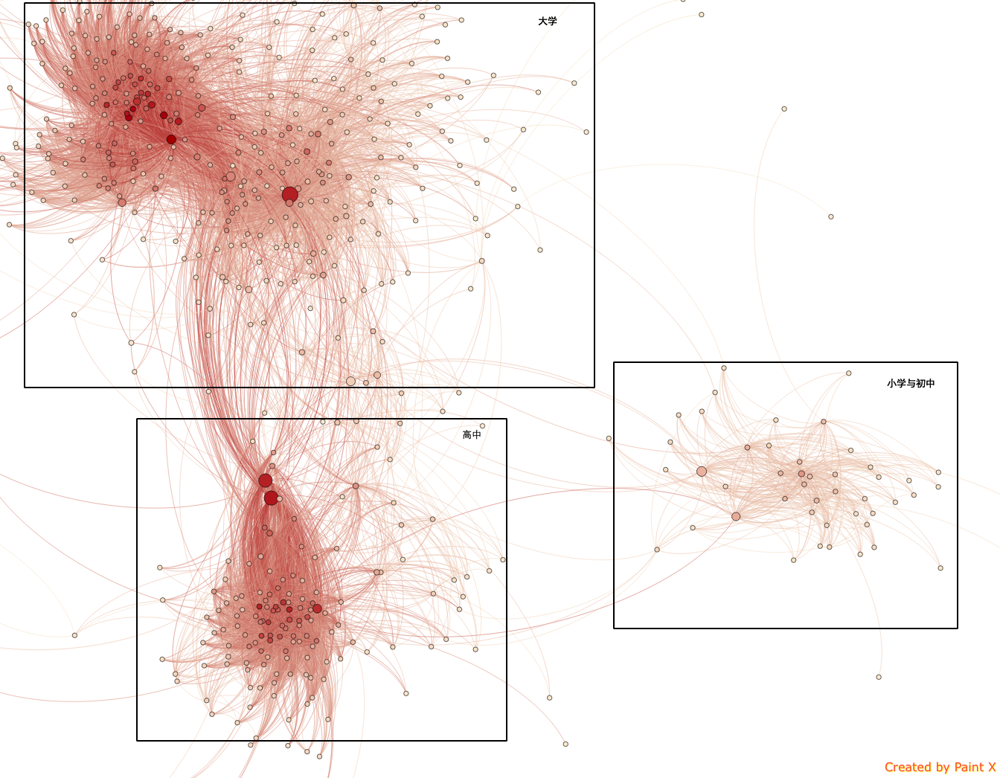

# scarenren

scarenren是一个基于scala的人人分析工具

## 目的

帮同学写的一工具，用完了，就开源了。

## 构建

项目使用sbt构建，构建环境为`jdk1.7 scala2.11 sbt 0.13.8`

## 功能

1. 好友学校统计，在生成的`Output-Data.txt`中
2. 好友关系图，在生成的`headless_simple.png`和`headless_simple.png`中
3. 待续

## 使用

编译并运行需要指令`sbt run`，代码只在os x环境下使用过，不知道其他系统会不会有问题，第一次编译可能需要时间比较长，需要下载各种库，之后会快很多。

PS: gephi在导出的时候，会有报错，形如
	
	java.lang.InterruptedException: sleep interrupted
		at java.lang.Thread.sleep(Native Method)
		at org.gephi.data.attributes.event.AttributeEventManager.run(AttributeEventManager.java:87)
		at java.lang.Thread.run(Thread.java:745)
	java.lang.InterruptedException
		at java.lang.Object.wait(Native Method)
		at java.lang.Object.wait(Object.java:503)
		at org.gephi.graph.dhns.core.GraphStructure$ViewDestructorThread.run(GraphStructure.java:240)

但是对结果没有影响，run的结果还会是success。这些异常似乎catch不住，有待解决。

## 代码阅读指南（程序执行指南）

程序最主要的类是在renren.scala中，首先程序会读取在`userinfo.ini`中的用户名密码，然后取得用户的好友列表，最后根据好友列表，生成好友关系图。样例如下，名字已经全部和谐Orz

<figure>
	
</figure>

在根据好友列表生成好友关系图的时候，使用了Actor来并发地处理请求，但是因为从未接触过这种线程模型，代码不太靠谱，有时候会有一些bug，这里的建议是多次执行以期望能得到成功的一次= =

另外在画图的时候使用了gephi-toolkit，现行的情况是，好友的关系越多，边的颜色越偏红，节点也越大，本身就geohi而言，其功能非常丰富，这方面还有很大的扩展空间。

## 未完成

* 优化friendnetwork.scala中的marshal，不需要读入文件时都存入内存，边读入边遍历，可使用解释器模式
* grapher.scala优化画图风格
* 寻找更合适的actor使用方法，以及如何terminate一个actor